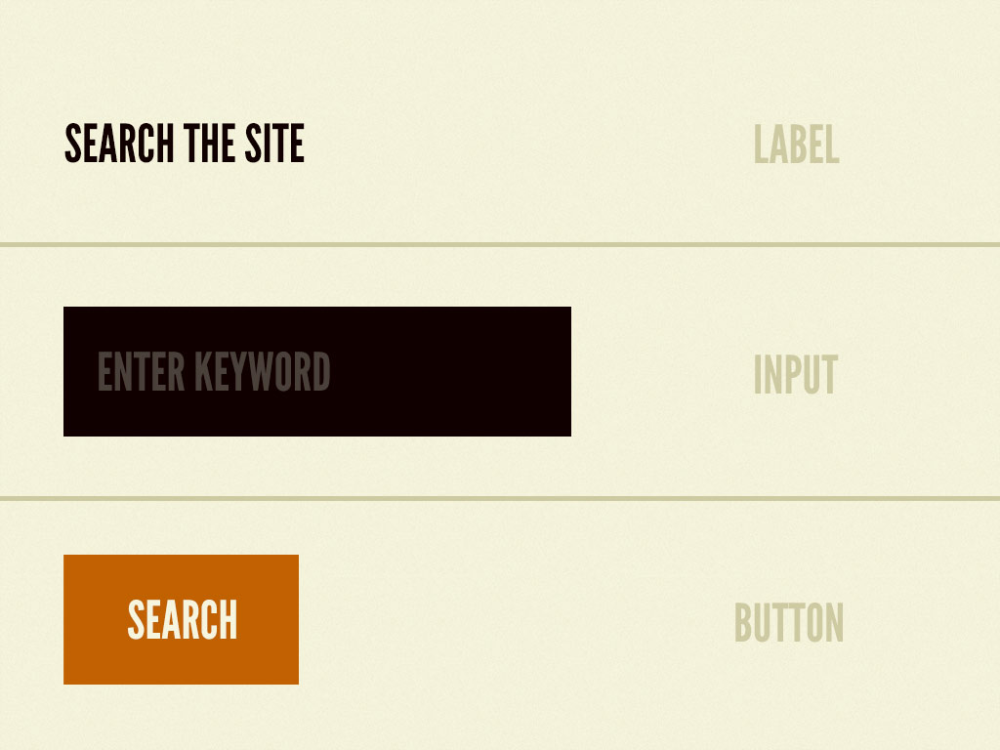

# Atomic design 

## What is it
It is a methodology that constrain you to think about system of components instead of collection of web pages. 

## How it works
There are five distinct levels in atomic design:
- [Atoms](#atoms)
- [Molecules](#molecules)
- [Organisms](#organisms)
- [Templates](#templates)
- [Pages](#pages)

### Atoms
They are the HTML tags like an `h1`, the smallest entities on a web page. Such as a form label, an input field or a button.

Atoms include also abstract elements like colours or fonts.  

### Molecules
Molecules are groups of atoms bounded together. And they serve as skeleton for our design system.

### Organisms
When we combine molecules together we form organism. An organism is a complex, distinct section of an interface. For example a masthead consist of diverse components like a logo, a primary navigation, a search form. 

### Templates
Templates consist mostly of groups of organisms stitched together to form pages. It’s where we are able to see components in action being arrange in layouts. Templates are also where clients start seeing the final design in place.

### Pages
Pages are specific instances of templates. It means that placeholder content is replaced with real representative content. 

## What are the benefits
Building up from molecules to organisms encourages creating standalone, portable, reusable components. Specifically for the new university website this methodology allows us to build a pattern library that will help the project be maintainable and future friendly allowing the new website to evolve fluently.

### References
- [Pattern library demo](http://demo.patternlab.io/)
- [Pittsburg Food Bank pattern library](http://foodbank.bradfrostweb.com/patternlab/v10/)
- [Kirby CMS pattern library](http://ui.getkirby.com/panel/)
- [Ushahidi pattern library](http://github.ushahidi.org/platform-pattern-library/)

#### Notes
This document is __heavily inspired__ by [Brad Frost’s article on Atomic Design](http://bradfrost.com/blog/post/atomic-web-design/). Certain expression and all images are taken from his post.  

